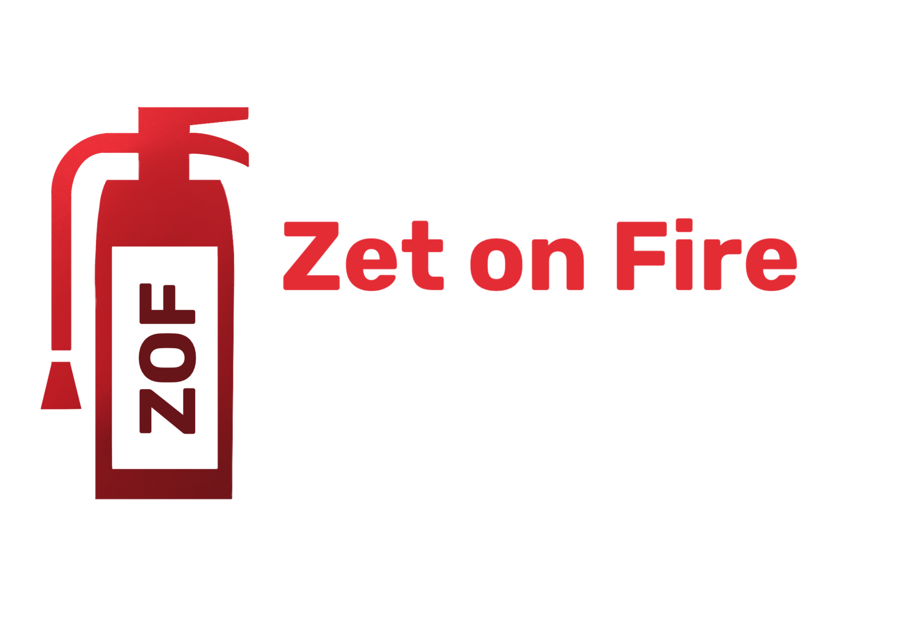

<h1 align="center"><em>Team Z</em> 🧯</h1>

 

## 📋 Description
### <em>We are Team Z(et on Fire), and our mission is to create a website where you can report fire incidents happening in your area. Our platform is designed to make filling out the form easy for everyone. Additionally, we provide access to our team information and charts.</em>

## 🗣 Languages
 

 

## 🎨Design
 

    
 

## 📞Collaborative services
 

 

## 📁 Documents

### Documentation
- [Documentation]()

### Presenting
- [Presentation]()

## 👥 Team

| **Name** | **Role** | **Grade** |
| :---:   | :---: | :---: |
| David  Papazqn | Scrum trainer | 🟨 9A |
| Ivelin Metodiev | Front-End Developer  | 🟩 9V  |
| Ivayla Keserdzhieva | Back-End developer  | 🟦 9G |
| Ekaterina Zalinskaya | Designer  | 🟥 9B |
